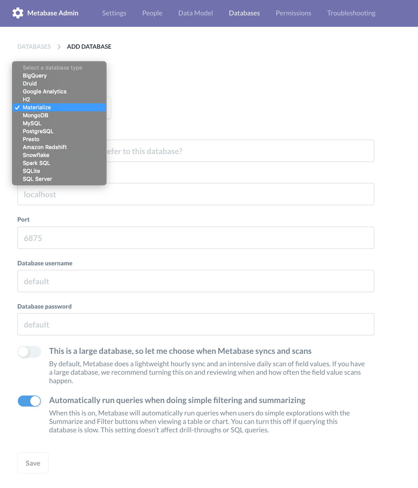

# metabase-materialize-driver

The `metabase-materialize-driver` lets
[Metabase](https://github.com/metabase/metabase) connect to an instance of
[Materialize](https://github.com/MaterializeInc/materialize).



## To Use the Driver

To use the `metabase-materialize-driver`, copy the driver's `.jar` file into the
`/plugins` directory of your Metabase instance. Metabase will register the
driver automatically! (For deployment-specific details, please consult the
following sections.)

Once the Materialize driver is registered, use the following information to
connect:

| Field             | Value     |
| ----------------- |:---------:|
| Host              | localhost |
| Port              | 6875      |
| Database username | default   |
| Database password | default   |


### With Docker

To generate a Metabase Docker image containing the Materialize driver, use [our
Dockerfile](Dockerfile) and run the following command from your terminal:

```shell script
cd /path/to/metabase-materialize-driver
bin/build-docker.sh
```

Then, to start the container, run:
```shell script
docker run --rm -p 3000:3000 --name metabase materialize/metabase:latest
```

Once it's finished loading, you can access Metabase at <localhost:3000>.

**NB: If you are running this on a Mac and running Materialize locally, you can
connect by substituting the following connection information:**

| Field             | Value                |
| ----------------- |:--------------------:|
| Host              | [host.docker.internal](https://stackoverflow.com/questions/24319662/from-inside-of-a-docker-container-how-do-i-connect-to-the-localhost-of-the-mach/24326540#24326540) |


### Without Docker

Use this driver in two steps:

1. Download a copy of the driver by running:
   ```shell script
   bin/build.sh --release v0.0.5 --no-docker
   ```
   or visiting the [releases](./releases) page and downloading one of the
   jars

1. Move the downloaded copy of the plugin (from the previous step) into the
   `/plugins` directory of your Metabase instance.

For more info, check out these resources:
* [Managing databases in Metabase](https://www.metabase.com/docs/latest/administration-guide/01-managing-databases.html)
* [Driver plugins in Metabase](https://github.com/metabase/metabase/wiki/Writing-a-Driver:-Packaging-a-Driver-&-Metabase-Plugin-Basics)


## To Build the Driver

**NB: These steps are not necessary to use the `metabase-materialize-driver`!
They are only for the curious or those attempting to make updates. To just use
the driver, stick to `How to use the driver` above.**

### Step 1: Use the forked pgjdbc Driver to connect to Materialize

Connecting to Materialize is nearly identical* to connecting to PostgreSQL. For
that reason, we use a slightly modified [`pgjdbc`
fork](https://github.com/MaterializeInc/pgjdbc) to provide the underlying SQL
Driver.

To use the forked Driver, we go through the following steps:
1. Check out the forked `MaterializeInc/pgjdbc` repo locally.
1. Build a shaded jar with:

    ```shell script
    mvn clean && mvn package -DskipTests -Dmaven.javadoc.skip=true -P release-artifacts
    ```

1. Check out this repo locally and move the resulting jar into the `/src`
   folder.

    ```shell script
    mv /path/to/postgresql-1-MZ-SNAPSHOT.jar /path/to/metabase-materialize-driver/src/
    ```

1. Extract the files from the jarfile **into** the `/src` directory.

    ```shell script
    tar -xvf postgresql-1-MZ-SNAPSHOT.jar
    ```
1. Remove the resulting `META-INF/` directory.

    ```shell script
    rm -rf /path/to/metabase-materialize-driver/src/META-INF/
    ```

### Step 2: Build and move the metabase-materialize-driver

1. Once we've successfully completed copying over the code from the forked
   Driver, we're ready to build the `metabase-materialize-driver`.

    ```shell script
    cd /path/to/metabase-materialize-driver
    lein clean && lein uberjar
    ```
    When the `uberjar` command finishes executing, it will output the path to
    the newly created uberjar like:

    ```shell script
    Compiling metabase.driver.materialize
    Created /path/to/metabase-materialize-driver/target/materialize-driver-0.0.1-SNAPSHOT.jar
    Created /path/to/metabase-materialize-driver/target/    materialize-driver-0.0.1-SNAPSHOT-standalone.jar
    ```

1. Move the `standalone.jar` (the uberjar) over to the `/plugin` directory of
   our local copy of Metabase:

    ```shell script
    cp /path/to/metabase-materialize-driver/target/ materialize-driver-0.0.1-SNAPSHOT-standalone.jar /path/to/metabase/plugins/
    ```

Once the `metabase-materialize-driver` jar is in the `/plugins` directory,
Metabase will register the plugin on startup!
